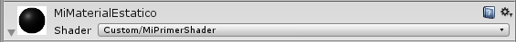
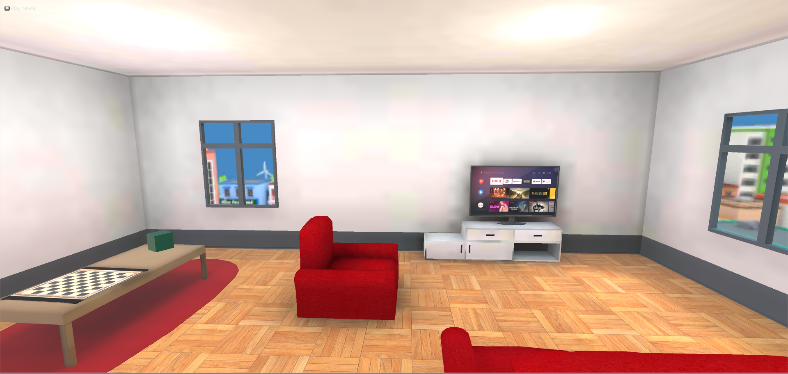

# PRÁCTICA DE LABORATORIO 

### CARRERA: Computación	ASIGNATURA: Programación Hipermedial

### NRO. PRÁCTICA:	7	

### TÍTULO PRÁCTICA: Desarrollo de una aplicación de realidad virtual usando la herramienta Unity y desplegada en un dispositivo móvil Android.

## OBJETIVO ALCANZADO:

- Experimentar con aplicaciones de realidad virtual.
- Experimentar con aplicaciones de realidad aumentada.
- Distinguir la diferencia entre tecnologías de realidad virtual y realidad aumentada.

## ACTIVIDADES DESARROLLADAS

### 1.	El Apartamento debe tener al menos 25 modelos prefabs (objetos 3D) que deben ser colocados apropiadamente dentro de la escena. Los objetos no pueden estar flotando sin motivos reales.

Se usaron más de 25 objetos, como se puede ver a continuación.
              
   

### 2.	Crear al menos un material para cambiar el color de uno o varios objetos de la escena.

Se crearon los siguientes materiales:

Color blanco para los objetos de madera

 

Color café para objetos de madera

 

Color para las paredes:

#### 3.	Crear un tablero de ajedrez y colocarlo sobre un objeto (por ejemplo: mesa, estante, etc) usando materiales y texturas.

Material utilizado:

Textura importada:

### 4.	Crear al menos tres cuadros o portarretratos con imágenes del estudiante y su familia.

Se crearon los siguientes cuadros, en este caso, se utilizó un assert ofrecido en la tienda oficial de Unity, llamado “Classic Picture Frame”.

### 5.	Crear un globo terráqueo usando una textura con base a una imagen del mapa del mundo.

Se creó el globo terráqueo, y se usó la textura dotada por “UdacityVR”.

 

### 6.	Crear al menos un shader que cambie el color de un objeto con base al tiempo transcurrido desde la ejecución de la app.

Código del archivo para cambiar los colores en base al tiempo.

 

Objeto:

 

Configuraciones:

 

### 7.	Animar las manecillas del reloj.

Animación del secundero:

 

Para el minutero y horero se usó la misma lógica, con diferencia en el tiempo inicial y final para cada propósito. Para el minutero se usó de 0 a 60, y para el horero 720 segundos.

### 8.	Crear un trigger que permita cambiar el sentido de una de las manecillas del reloj.

Se creó el trigger con las transiciones necesarias para hacer el cambio de animación.

 

### 9.	Animar el globo terráqueo para que gire horizontalmente.

Para la animación del globo terráqueo se alteraron los valores de “x”, “y”, “z” de la rotación, dándonos una animación inclinada, ajustándose a la forma del estante del globo.

  

### 10.	Crear un trigger que permita girar y detener la animación del globo terráqueo.

Para adaptar el trigger a la animación, se optó por crear una animación con la rotación principal del globo, para que después se detenga la animación, cuando se vuelva a llamar al trigger.

   

### 11.	Añadir una cámara de realidad virtual (GoogleVR) y colocarla para que la aplicación inicie dentro de la escena del apartamento.

Se agregó el componente que soporta GoogleVR con su cámara respectiva.

  

### 12.	Actualizar las configuraciones del jugador (Nombre de la compañía, nombre del producto, paquete, soporte para VR, etc)

Se realizaron las configuraciones principales en las configuraciones del jugador, estas incluyen configurar los PATH del SDK de Android studio y la selección de la versión configurada en este, entre otras.

  
 
 
### 13.	Añadir luces a la escena.

Se añadieron las luces pertinentes, optimizadas para el uso en un celular para generar sombras y ofrecer una buena visibilidad al usuario.

Estudio:

  

Sala:

 

### 14.	Agregar sonidos.

Se configuró el sonido de una ciudad de fondo, para ello se utilizó el script proporcionado en la práctica.

 
 
### 15.	La evidencia del correcto diseño de la escena 

Parte delantera:

 

Parte trasera:

  

### 16.	Evidencia del correcto funcionamiento de la aplicación

Se exportó un archivo APK y se probó en un dispositivo Android.

Video: https://drive.google.com/file/d/1z3ZMpjM5Q1jUQso-8SFPngXejUfGExSs/view?usp=sharing

### 17.	Crear un repositorio en GitHub con el nombre “Practica07 – Apartamento VR”.

Usuario: czhizhpon

Enlace: https://github.com/czhizhpon/Practica07-ApartamentoVR.git

## RESULTADO(S) OBTENIDO(S):

Se experimentó con aplicaciones para la creación de proyectos orientados a la realidad virtual y por consecuente la realidad aumentada aplicando los conceptos para llevar un departamento en un ambiente virtual.

## CONCLUSIONES:

Tanto la realidad virtual como la realidad aumentada están en auge, aunque son tecnologías están por sus primeros pasos, ha demostrado ser de gran utilidad en varios ámbitos como la educación, medicina, etc. Algo en que se ha caracterizado estas tecnologías, es llevar nuevas experiencias a los usuarios, ya que este, es un nuevo mundo para descubrir.

## RECOMENDACIONES:

Leer la documentación dotada por Unity.

**Nombre de estudiante:** Zhizhpon Tacuri Cesar Eduardo

**Firma de estudiante:**   

